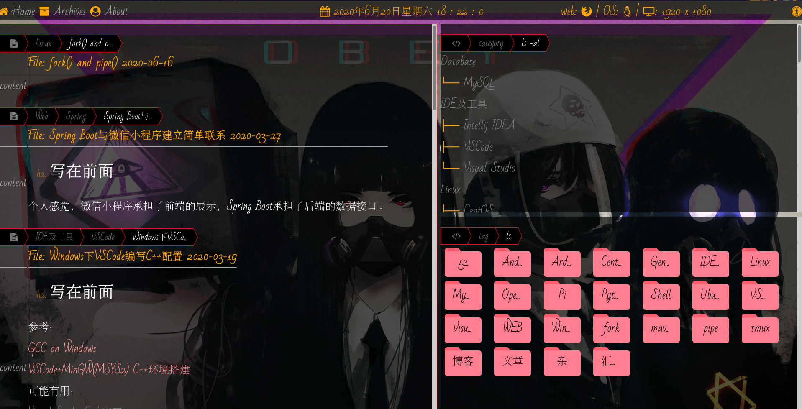
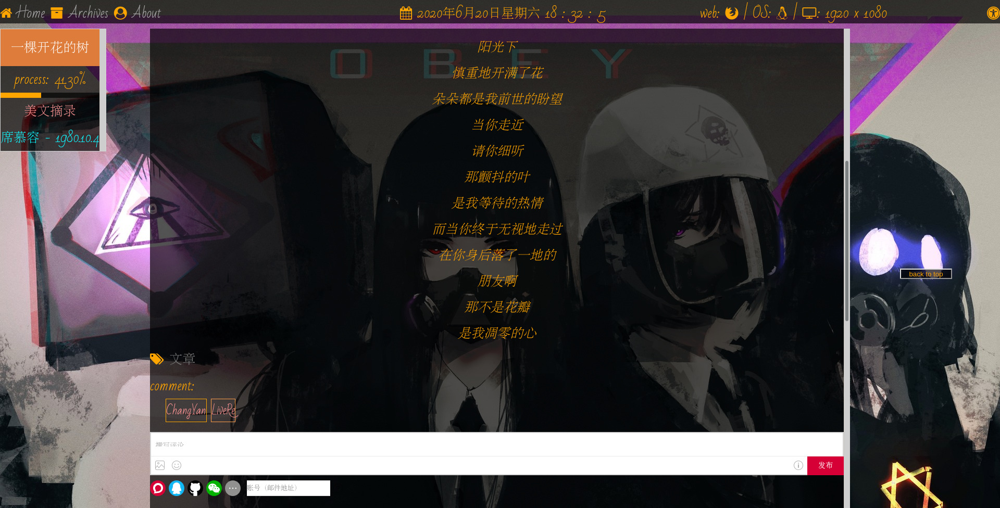

# 主题：hexo-theme-milk

## 预览





## 使用

**进入 hexo 目录**

1. 下载主题

```bash
git clone https://github.com/MRsoymilk/hexo-theme-milk.git themes/milk
```

2. 主题依赖

主题使用`scss`

```bash
npm install hexo-renderer-scss
```

3. 切换主题

修改`_config.yml`

```yaml
theme: milk
```

4. 主题高亮

默认使用[highlight.js](https://highlightjs.org/)的`monokai-sublime`主题。自定义设置请下载相应代码并放置在`themes/milk/source/lib/highlight/`目录中。

使用自定义主题，修改`themes/milk/_config.yml`

```yaml
highlight: monokai-sublime
```

使用自定义高亮需要关闭`Hexo`默认高亮，修改`_config.yml`

```yaml
highlight:
  enable: false
  line_number: true
  auto_detect: false
  tab_replace: ""
  wrap: true
  hljs: false
```

## 其他

### 标签云文件夹

[FFolders](https://github.com/jlizanab/FFolders)

设置颜色:

- cyan
- yellow
- pink
- green
- gray

大小:

- small
- medium
- big

修改位置:

文件: `themes/milk/source/js/milk.js`

```javascript
// tags style
$(() => {
  $("#list-cloud a").wrap('<div class="ffolder small pink"></div>');
  ...
}
```

### 鼠标样式

修改位置:

使用文件: `themes/milk/source/css/_partial/variable.scss`中`$cursor_normal`, `$cursor_link`

资源文件: `themes/milk/source/cursor/`

### 网页图标

修改位置:

文件: `themes/milk/source/favicon/favicon.ico`

### 背景图片

修改位置:

文件: `themes/milk/source/background.jpg`

### 更多

更多网页相关比如颜色、间距等可以在`themes/milk/source/css/_partial/variable.scss`找到。
